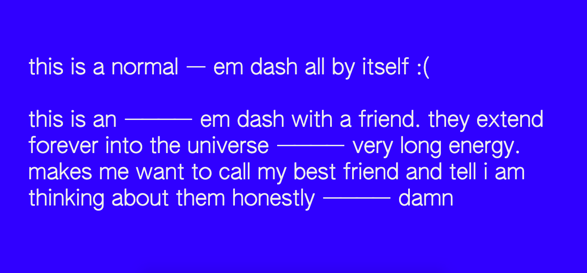

<h1 align="center">Emdash Extending Forever Into The Universe</h1>



### Abstract
Em dashes ——————— aren't long enough

### Features
1. Longer em dashes

Installation
----

`npm install emdash-extending-forever-into-the-universe` lmao

Include `emdash-extending-forever-into-the-universe.min.js` at the end of your `body`.  Next, call `foreverIntoTheUniverse();`. You will probably want to call this once the DOM has loaded, so make sure to do so, although I'm sure you could get away without it. That's pretty much it. All your `—`s should be longer now.

```html
	<script type="text/javascript" src="emdash-extending-forever-into-the-universe.min.js"></script>
	<script type="text/javascript">
		document.addEventListener("DOMContentLoaded", function() {
			foreverIntoTheUniverse();
		});
	</script>
</body>
```

Options: `'Defaults'`
---

```js
foreverIntoTheUniverse({
	howLong: 2, // even longer if u want
	whatToReplace: '—', // u can make underscores and shit long too if u want
	whereToReplace: 'body', // u can use specific classes or an id here too. no support for children or other elements sry
	howMuchCloserCouldWePossiblyBe: '0.25' // sometimes font hinting fucks this up a bit, so you can adjust this if so. this is a negative value
});
```

Colophon ——————————
---
The type used in the demo image is AUTHENTIC Sans 60 by [AUTHENTIC](https://authentic.website/).


<p align="center">made w love by your friends at</p>
<p align="center"></p>
